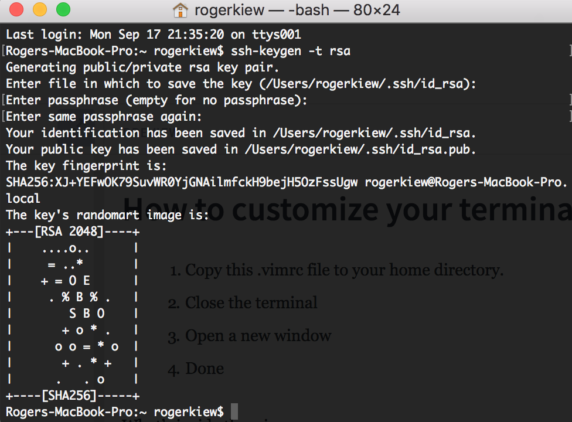
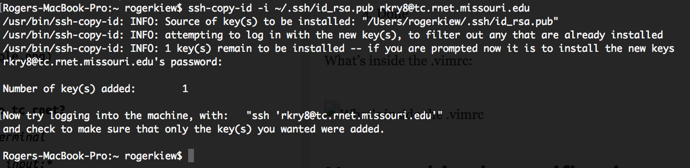
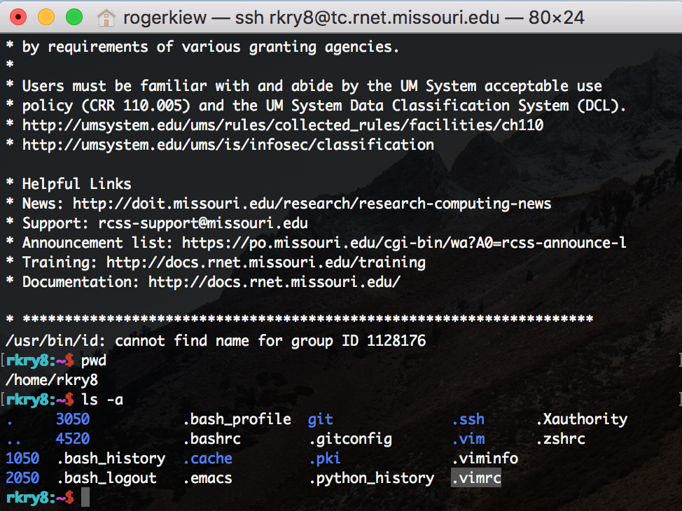
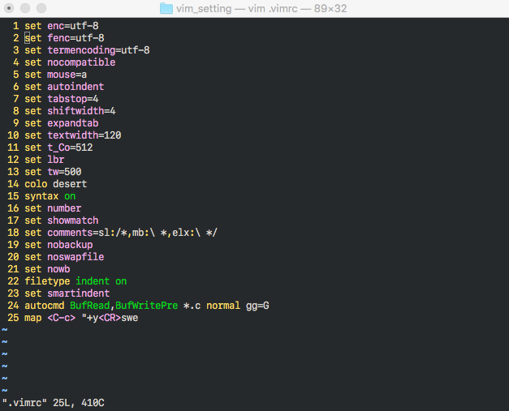
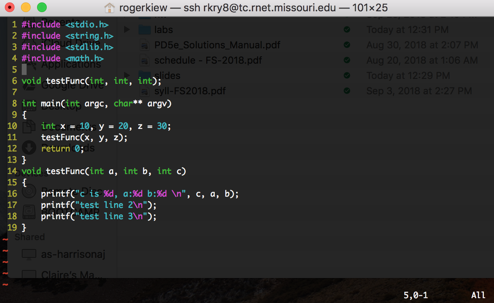
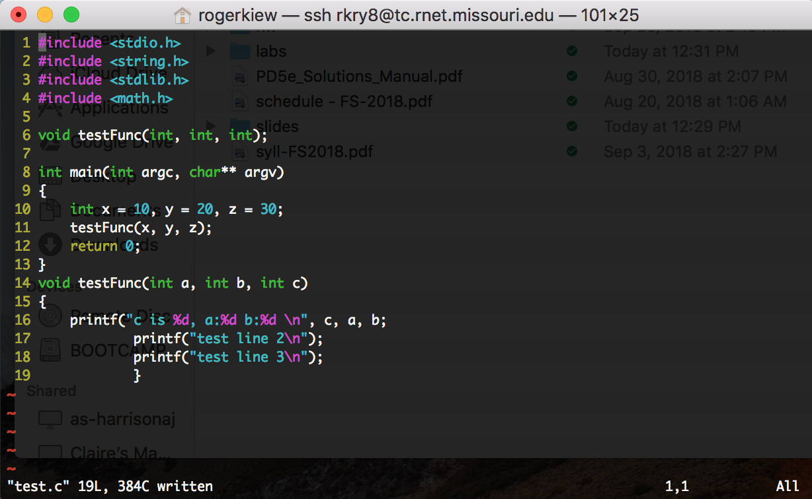
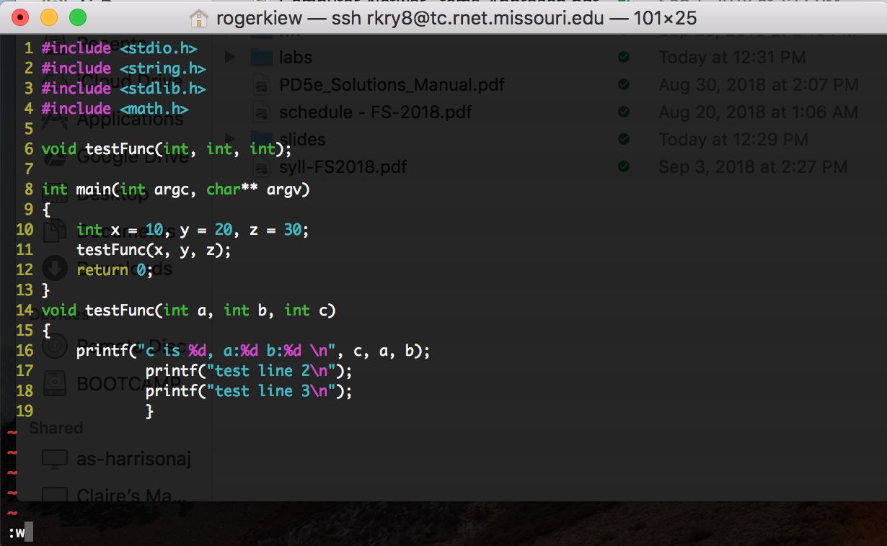

# How to create an alias to login to tc.rnet?
1. Edit the .bash_profile on terminal

   Type the following code on terminal:

    ```vim .bash_profile```
    
    
2. Add the following alias

    Type the following code in the .bash_profile file:

    **alias OOO='ssh user@host'**
    
    In my case:
    
    ```alias TC='ssh rkry8@tc.rnet.missouri.edu'```
    
    After you're done, save the file with :wq like you save other files.
    
3. Update the source

    Type the following code on termal:

    ```source ~/.bash_profile```
    
4. Done, now you can type TC or whatever alias you put to login


# How to skip the verification to tc.rnet?
1. Generate a ssh key for your machine on local terminal

    Type the following code on terminal:

    ```ssh-keygen -t rsa```
    
    **_I personally don't worry about the other settings so you can leave blank for everything, keep hitting enter until you can type the next command_**



2. Upload the generated public ssh key to tc.rnet

    Type the following code on terminal:

    **ssh-copy-id -i ~/.ssh/mykey user@host**
    
    In my case: 
    
    ```ssh-copy-id -i ~/.ssh/id_rsa.pub rkry8@tc.rnet.missouri.edu```
    
    Select the public key, and it will ask you to type your password.
    


3. Done!

# How to use the auto indentation?

1. Copy this .vimrc file to your home directory
	You can either:
		
	(a)copy the content from my file, type "vim .vimrc" on terminal and paste, :wq to save
		
	(b)download the file to your computer, use a software like FileZilla to upload to your home directory

	The home directory refers to the default path when you log in to tc.rnet, when you type pwd it should show you: 

	**/home/pawprint**

	In my case:

	**/home/rkry8**

As the picture:




2. Update the source file.

    Type the following code on terminal:

    ```source .vimrc```
    
    After you're done, save the file with :wq like you save other files.
    
3. Done

What's inside the .vimrc:
    


# After everything is all set, let's give it a try!

Try editing any of the existing .c files, remove any of the closing parenthesis, leave insert mode, type :w for write and see if the editor did the auto indentation for you. 





Next time when the indentation goes weird, you only need to put the missing parenthesis/brackets/curly braces back and type :w again, it will fix the indentation for you.



Then it should go back to normal


Leave a comment if the document isn't clear enough.


# Copy the contents of the id_rsa.pub file to your clipboard

`cat < ~/.ssh/id_rsa.pub`

or

`clip < ~/.ssh/id_rsa.pub
